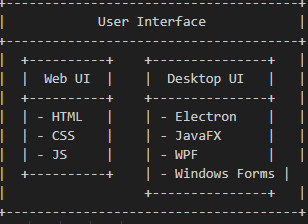
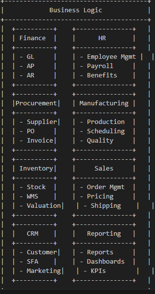
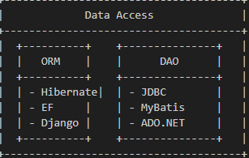
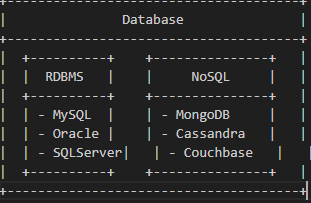

# ERP System Architecture

This diagram represents the architecture of our ERP system, including the user interface, business logic, data access, and database layers.
# User interface

# Business logic
 
 # Data access
  
  # Database
   

The diagram showcases the different components and technologies used in each layer of the architecture.
